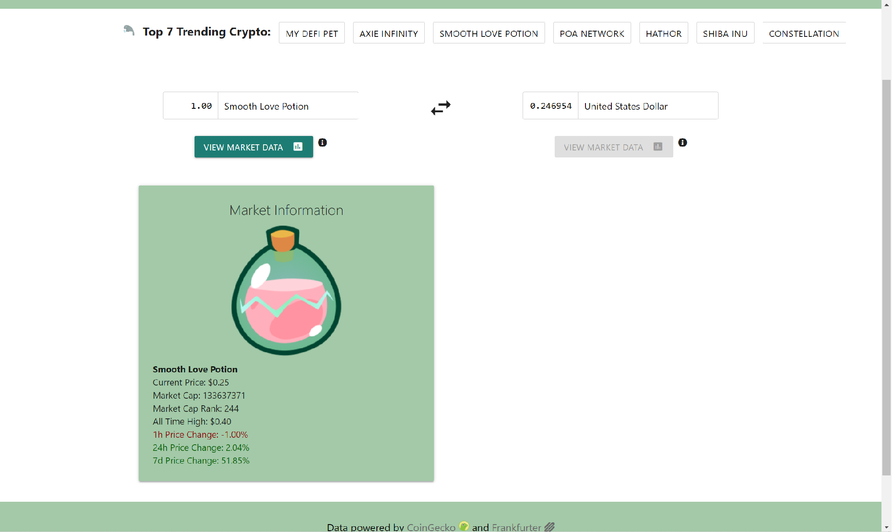

<h1 align="center"><strong>Currency Compare</strong></h1>

[https://kkolyvek.github.io/crypto-compare/](https://kkolyvek.github.io/crypto-compare/)

Currency Compare is a website for market enthusiasts to quickly compare up-to-date values of currencies used all over the world. Begin typing into the currency search field to access over 8,000 cryptocurrencies as well as 33 conventional currencies. The site also allows the user to view basic market data of a selected cryptocurrency.

---

> 

---

## About

Currency Compare is responsive website designed to deliver information to the user as seamlessly as possible. Any time a valid currency is typed into the input field or selected from the autocomplete list, the corresponding data is automatically updated and displayed; this allows the users to quickly check on all the currencies they may be interested in.

In the modern world of cryptocurrencies, value can change at the blink of an eye. In an effort to stay on top of this, Currency Compare fetches fresh data everytime a currency is inputted.

---

## Built With:

Currency Compare makes use of the following services:

- [CoinGecko](https://www.coingecko.com/en)
- [Frankfurter](https://www.frankfurter.app/)
- [Materialize CSS](https://materializecss.com/)

---

## Additional Information:

Currency Compare makes use of your browser's local storage to speed up load times on successive visits to the page. If you no longer wish to store this data, delete the following objects from your storage:

- `coinObject`
- `coinObjectRef`
- `currencyObject`
- `currencyObjectRef`
- `combinedObject`
- `combinedObjectRef`
